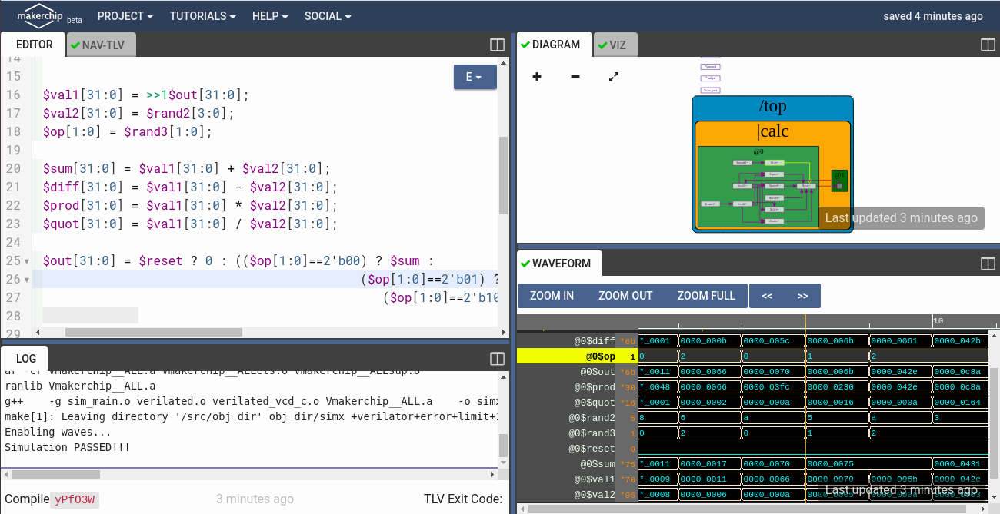
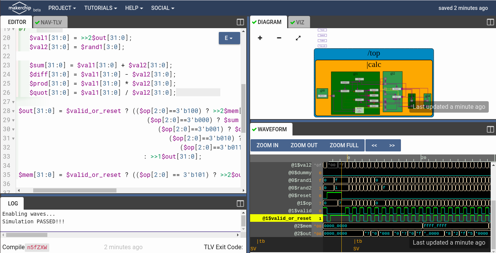
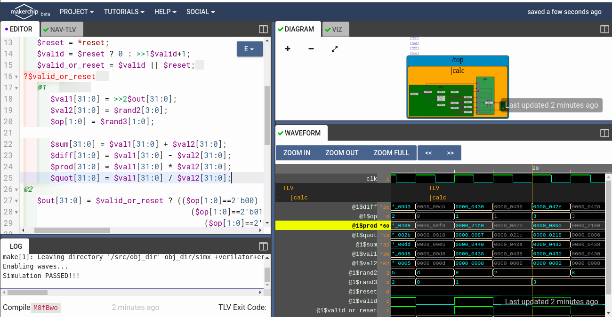

# RISC-V based Microprocessor

This repository contains all the information needed to build your RISC-V pipelined core, which has support of base interger RV32I instruction format using TL-Verilog on makerchip platform.

# Table of Contents
- [Introduction to RISC-V ISA](#introduction-to-risc-v-isa)
- [Overview of GNU compiler toolchain and Introduction to ABI](#overview-of-gnu-compiler-toolchain-and-introduction-to-abi)
- [Digital Logic with TL-Verilog and Makerchip](#digital-logic-with-tl-verilog-and-makerchip)
  - [Combinational logic](#combinational-logic)
  - [Sequential logic](#sequential-logic)
  - [Pipelined logic](#pipelined-logic)
  - [Validity](#validity)
- [Basic RISC-V CPU micro-architecture](#basic-risc-v-cpu-micro-architecture)
  - [Fetch](#fetch)
  - [Decode](#decode)
  - [Register File Read/Write](#register-file-read-/-write)
  - [Execute](#execute)
  - [Control Logic](#control-logic)
- [Pipelined RISC-V CPU](#pipelined-risc-v-cpu)
  - [Pipelinig the CPU](#pipelining-the-cpu)
  - [Load and store instructions and memory](#load-and-store-instructions-and-memory)
  - [Completing the RISC-V CPU](#completing-the-risc-v-cpu)
- [Contributors](#contributors)
- [Acknowledgements](#acknowledgements)
- [Contact Information](#contact-information)

# Introduction to RISC-V ISA 

A RISC-V ISA is defined as a base integer ISA, which must be present in any implementation, plus optional extensions to the base ISA. Each base integer instruction set is characterized by
  1. Width of the integer registers (XLEN) 
  2. Corresponding size of the address space
  3. Number of integer registers (32 in RISC-V)

More details on RISC-V ISA can be obtained [here](https://github.com/riscv/riscv-isa-manual/releases/download/draft-20200727-8088ba4/riscv-spec.pdf).

# Overview of GNU compiler toolchain and Introduction to ABI

The GNU Toolchain is a set of programming tools in Linux systems that programmers can use to make and compile their code to produce a program or library. So, how the machine code which is understandable by processer is explained below.

  * Preprocessor - Process source code before compilation. Macro definition, file inclusion or any other directive if present then are preprocessed. 
  * Compiler - Takes the input provided by preprocessor and converts to assembly code.
  * Assembler - Takes the input provided by compiler and converts to relocatable machine code.
  * Linker - Takes the input provided by Assembler and converts to Absolute machine code.

Under the risc-v toolchain, 
  * To use the risc-v gcc compiler use the below command:

    `riscv64-unknown-elf-gcc -Ofast -mabi=lp64 -march=rv64i -o <object filename> <C filename>`

    More generic command with different options:

    `riscv64-unknown-elf-gcc <compiler option -O1 ; Ofast> <ABI specifier -lp64; -lp32; -ilp32> <architecture specifier -RV64 ; RV32> -o <object filename> <C      filename>`

    More details on compiler options can be obtained [here](https://www.sifive.com/blog/all-aboard-part-1-compiler-args)

  * To view assembly code use the below command,
    
    `riscv64-unknown-elf-objdump -d <object filename>`
    
  * To use SPIKE simualtor to run risc-v obj file use the below command,
  
    `spike pk <object filename>`
    
    To use SPIKE as debugger
    
    `spike -d pk <object Filename>` with degub command as `until pc 0 <pc of your choice>`

    To install complete risc-v toolchain locally go to [this](https://github.com/kunalg123/riscv_workshop_collaterals) github repository and run the `run.sh` file.

An Application Binary Interface is a set of rules enforced by the Operating System on a specific architecture. So, Linker converts relocatable machine code to absolute machine code via ABI interface specific to the architecture of machine.

# Digital Logic with TL-Verilog and Makerchip

[Makerchip](https://makerchip.com/) is a free online environment for developing high-quality integrated circuits. You can code, compile, simulate, and debug Verilog designs, all from your browser. Your code, block diagrams, and waveforms are tightly integrated.

All the examples shown below are done on Makerchip IDE using TL-verilog. Also there are other tutorials present on IDE which can be found [here](https://makerchip.com/sandbox/) under Tutorials section.

## [Combinational logic](codes/Combinational_Calculator.tlv)

Starting with basic example in combinational logic is an inverter. To write the logic of inverter using TL-verilog is `$out = ! $in;`. There is no need to declare `$out` and `$in` unlike Verilog. There is also no need to assign `$in`. Random stimulus is provided, and a warning is produced. 

Below is snapshot of Combinational Calculator.


## [Sequential logic](codes/Sequential_Calculator.tlv)

Starting with basic example in sequential logic is Fibonacci Series with reset. To write the logic of Series using TL-Verilog is `$num[31:0] = $reset ? 1 : (>>1$num + >>2$num)`. This operator `>>?` is ahead of operator which will provide the value of that signal 1 cycle before and 2 cycle before respectively.

Below is snapshot of Sequential Calculator which remembers the last result, and uses it for the next calculation.



## [Pipelined logic](codes/Cycle_Calculator.tlv)

Timing abstract powerful feature of TL-Verilog which converts a code into pipeline stages easily. Whole code under `|pipe` scope with stages defined as `@?`

Below is snapshot of 2-cycle calculator which clears the output alternatively and output of given inputs are observed at the next cycle.



## [Validity](codes/Cycle_Calculator_Validity.tlv)

Validity is TL-verilog means signal indicates validity of transaction and described as "when" scope else it will work as don't care. Denoted as `?$valid`. Validity provides easier debug, cleaner design, better error checking, automated clock gating.

Below is snapshot of 2-cycle calculator with validity. 



# Basic RISC-V CPU micro-architecture

Designing the basic processor of 3 stages fetch, decode and execute based on RISC-V ISA.

## Fetch

* Program Counter (PC): Holds the address of next Instruction
* Instruction Memory (IM): Holds the set of instructions to be executed

During Fetch Stage, processor fetches the instruction from the IM pointed by address given by PC.

Below is snapshot from Makerchip IDE after performing the Fetch Stage.

## Decode

6 types of Instructions:
  * R-type - Register 
  * I-type - Immediate
  * S-type - Store
  * B-type - Branch (Conditional Jump)
  * U-type - Upper Immediate
  * J-type - Jump (Unconditional Jump)

Instruction Format includes Opcode, immediate value, source address, destination address. During Decode Stage, processor decodes the instruction based on instruction format and type of instruction.

Below is snapshot from Makerchip IDE after performing the Decode Stage.

## Register File Read/Write

Here the Register file is 2 read, 1 write means 2 read and 1 write operation can happen simultanously.

Inputs:
  * Read_Enable   - Enable signal to perform read operation
  * Read_Address1 - Address1 from where data has to be read 
  * Read_Address2 - Address2 from where data has to be read 
  * Write_Enable  - Enable signal to perform write operation
  * Write_Address - Address where data has to be written
  * Write_Data    - Data to be written at Write_Address

Outputs:
  * Read_Data1    - Data from Read_Address1
  * Read_Data2    - Data from Read_Address2

Below is snapshot from Makerchip IDE after performing the Register File Read/Write.

## Execute

During the Execute Stage, both the operands perform the operation based on Opcode.

Below is snapshot from Makerchip IDE after performing the Execute Stage.

## Control Logic

During Decode Stage, branch target address is calculated and fed into PC mux. Before Execute Stage, once the operands are ready branch condition is checked.

Below is snapshot from Makerchip IDE after including the control logic for branch instructions.

# Pipelined RISC-V CPU

Converting non-piepleined CPU to pipelined CPU using timing abstract feature of TL-Verilog. This allows easy retiming wihtout any risk of funcational bugs. More details reagrding Timing Abstract in TL-Verilog can be found in IEEE Paper ["Timing-Abstract Circuit Design in Transaction-Level Verilog" by Steven Hoover.](https://ieeexplore.ieee.org/document/8119264)

## Pipelining the CPU

Pipelining the CPU with branches still having 3 cycle delay rest all instructions are pipelined. Pipelining the CPU in TL-Verilog can be done in following manner:
```
|<pipe-name>
    @<pipe stage>
       Instructions present in this stage
       
    @<pipe_stage>
       Instructions present in this stage
       
```

Below is snapshot of pipelined CPU with a test case of assembly program which does summation from 1 to 9 then stores to r10 of register file. In snapshot `r10 = 45`. Test case:
```
*passed = |cpu/xreg[10]>>5$value == (1+2+3+4+5+6+7+8+9);
```

## Load and store instructions and memory

Similar to branch, load will also have 3 cycle delay. So, added a Data Memory 1 write/read memory.

Inputs:
  * Read_Enable - Enable signal to perform read operation
  * Write_Enable - Enable signal to perform write operation
  * Address - Address specified whether to read/write from
  * Write_Data - Data to be written on Address (Store Instruction)

Output: 
  * Read_Data - Data to be read from Address (Load Instruction)

Added test case to check fucntionality of load/store. Stored the summation of 1 to 9 on address 4 of Data Memory and loaded that value from Data Memory to r17.
```
*passed = |cpu/xreg[17]>>5$value == (1+2+3+4+5+6+7+8+9);
```
Below is snapshot from Makerchip IDE after including load/store instructions.

## Completing the RISC-V CPU

Added Jumps and completed Instruction Decode and ALU for all instruction present in RV32I base integer instruction set.

Below is final Snapshot of Complete Pipelined RISC-V CPU.

# Contributors

# Acknowledgements
- [Kunal Ghosh](https://github.com/kunalg123), Co-founder, VSD Corp. Pvt. Ltd.
- [Steve Hoover](https://github.com/stevehoover), Founder, Redwood EDA
- [Shivam Potdar](https://github.com/shivampotdar), GSoC 2020 @fossi-foundation
- [Vineet Jain](https://github.com/vineetjain07), GSoC 2020 @fossi-foundation


# Contact Information

